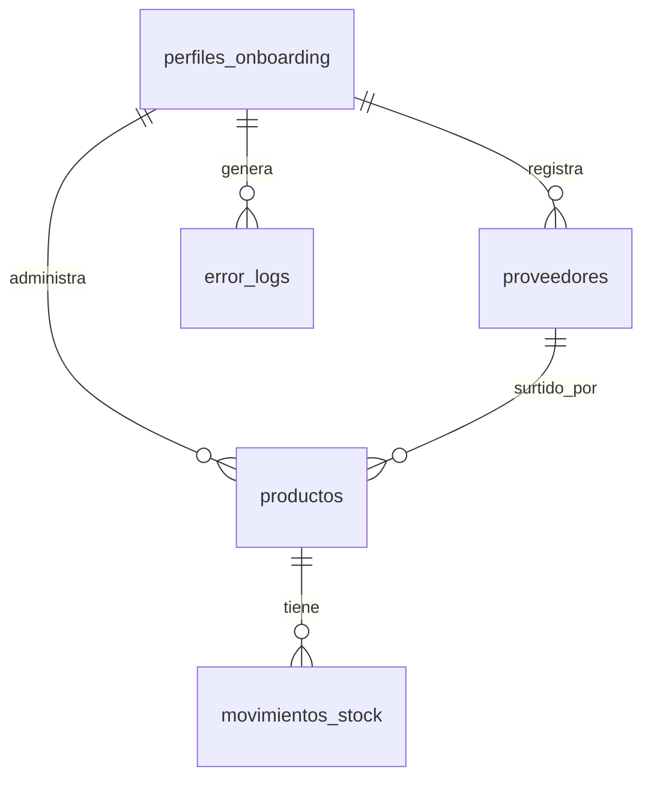

# Documentación de Funcionamiento - Mini Sistema PLG

Este documento explica en detalle la arquitectura, lógica de negocio, fórmulas matemáticas y la estrategia comercial (PLG) que sustentan el funcionamiento del **Mini Sistema de Alertas de Stock**.

---

## 1. Propósito y Estrategia PLG (Product-Led Growth)

El sistema está diseñado como una herramienta útil y atractiva para pequeños comercios (PyMEs) pero con **fricción estratégica deliberada** para incentivar la conversión hacia el software principal, **Nodexa Core**.

### Guardrails (Límites del Plan Gratuito)
1.  **Límite de SKUs (Productos):** Máximo de **100 productos activos**. El plan base de Nodexa Core soporta hasta 1.000 SKUs e importación masiva.
2.  **Límite de Proveedores:** Máximo de **10 proveedores**.
3.  **Lógica de Consumo Lineal (Fricción de Cálculo):** El promedio se calcula dividiendo la suma total de salidas de los últimos 30 días de manera fija por 30. Esto hace que sea útil para rotaciones constantes, pero expone fluctuaciones rápidas ante ventas inusuales (picos).
    *   *Gancho de Ventas:* En la interfaz se muestra el cartel publicitario que ofrece migrar a Nodexa Core para acceder a "pronósticos de demanda avanzados, inmunidad ante picos extremos (outliers) y análisis de estacionalidad".
4.  **Botón de WhatsApp Directo:** El botón de soporte gratuito para probar Nodexa Core redirige al chat de WhatsApp configurado por el Super Administrador en el panel, cerrando el flujo de ventas sin intermediarios.

---

## 2. Fórmulas y Lógica de Inventario

El sistema ayuda al usuario a responder la pregunta crítica: **¿Cuándo debo comprarle a mi proveedor para no quedarme sin stock?**

### A. Consumo Diario Automático (En caliente / On-the-fly)
El consumo diario no requiere carga manual constante; el sistema lo calcula dinámicamente cada vez que se carga la página mediante la base de datos:
$$\text{Consumo Diario (Estimado)} = \frac{\text{Suma de cantidades de salidas de stock en los últimos 30 días}}{30.0}$$
*   Si un producto no registra movimientos de salida en los últimos 30 días, el sistema toma por defecto el valor de **Consumo Diario Manual** ingresado por el usuario al crear el producto.

### B. Punto de Pedido (PdP)
Es el umbral o nivel de stock que dispara la alerta de reabastecimiento:
$$\text{Punto de Pedido} = \text{Stock Mínimo} + (\text{Consumo Diario} \times \text{Días de Demora del Proveedor})$$

*   **Días de Demora del Proveedor ($d$):** Tiempo en días que tarda el proveedor en entregar el pedido.
*   **Consumo Diario ($c$):** Ritmo de salida diario del producto.
*   **Stock Mínimo ($SM$):** Colchón de seguridad que protege ante atrasos del proveedor o picos de ventas inusuales.

### C. Estados de Alerta Visuales
El sistema asigna un estado dinámico a cada producto comparando el **Stock Actual** contra el **Stock Mínimo** y el **Punto de Pedido**:

| Condición | Estado | Indicador Visual | Acción Recomendada |
| :--- | :--- | :--- | :--- |
| $\text{Stock Actual} \le \text{Stock Mínimo}$ | **CRÍTICO** | Rojo (Animado) | Stock insuficiente. Peligro inminente de quiebre. |
| $\text{Stock Mínimo} < \text{Stock Actual} \le \text{Punto de Pedido}$ | **REABASTECER** | Amarillo / Alerta | Hacer pedido hoy. Llegará antes de tocar el stock mínimo. |
| $\text{Stock Actual} > \text{Punto de Pedido}$ | **NORMAL** | Verde | Stock suficiente para cubrir la demanda y la demora. |

---

## 3. Modelo de Datos y Base de Datos (Supabase / PostgreSQL)

El sistema utiliza cinco tablas principales estructuradas bajo políticas de seguridad a nivel de fila (RLS):

### Tabla `proveedores`
*   `id` (UUID, Primary Key)
*   `user_id` (UUID, Foreign Key a auth.users)
*   `nombre` (Text) - Nombre de la empresa proveedora.
*   `dias_demora` (Integer) - Días promedio de entrega.

### Tabla `productos`
*   `id` (UUID, Primary Key)
*   `user_id` (UUID, Foreign Key a auth.users)
*   `proveedor_id` (UUID, Foreign Key a proveedores)
*   `nombre` (Text) - Nombre del SKU.
*   `stock_actual` (Integer) - Unidades físicas en estantería.
*   `stock_minimo` (Integer) - Stock de seguridad.
*   `consumo_diario` (Numeric) - Consumo manual por defecto.

### Tabla `movimientos_stock`
*   `id` (UUID, Primary Key)
*   `user_id` (UUID)
*   `producto_id` (UUID, Foreign Key a productos con borrado en cascada)
*   `tipo` (VARCHAR: 'entrada' o 'salida')
*   `cantidad` (Integer) - Cantidad del ajuste.
*   `proveedor_id` (UUID, Nullable) - Vinculación del proveedor involucrado.
*   `creado_en` (Timestamptz)

### Tabla `error_logs`
*   `id` (UUID, Primary Key)
*   `user_id` (UUID, Nullable)
*   `email` (VARCHAR, Nullable)
*   `codigo_error` (VARCHAR) - NX-VAL-xxx / NX-DB-xxx.
*   `mensaje` (Text) - Detalle de la excepción.
*   `stack` (Text, Nullable) - Stack trace para diagnóstico.
*   `contexto` (JSONB) - Parámetros del formulario o del request.

---

## 4. Control de Acceso y Panel Super Administrador

Para proteger la integridad comercial, el sistema separa de forma estricta los privilegios:

1.  **Rol Administrador:** Validado en el servidor contra la variable de entorno `ADMIN_EMAILS` y correos que contengan `mari_` o `admin`.
2.  **Panel de Trazabilidad Comercial:**
    *   **Dashboard PLG:** Estadísticas globales de conversión de usuarios (Horas ahorradas, quiebres evitados).
    *   **Dolores Detectados:** Gráfico de frecuencia de dolores registrados en el onboarding (ej. *"El proveedor tarda mucho"*).
    *   **Power Users:** Lista de usuarios que más utilizan el sistema para priorizar el outreach (contacto telefónico).
    *   **Auditoría de Logs de Errores:** Vista ordenada de excepciones para solucionar problemas en producción rápidamente.
